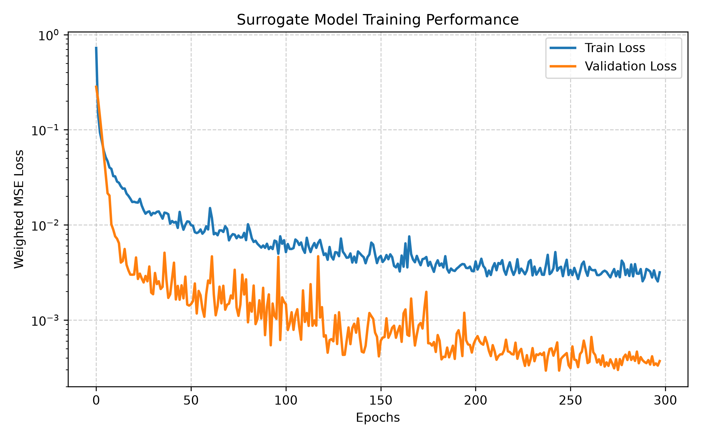
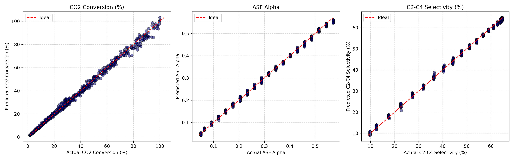
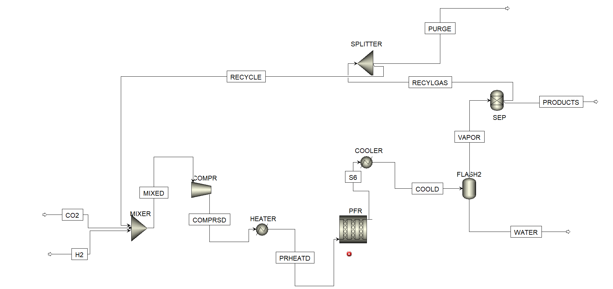

# Hybrid Digital Twin for CO₂ Hydrogenation to Light Olefins

A Hybrid Digital Twin framework for **CO₂ Hydrogenation to Light Olefins**, developed as part of the **IITISoC 2026** project.

The project combines:

- Physics-based reaction kinetics
- Machine Learning surrogate modeling
- Aspen Plus process simulation
- Python COM automation

to create a fast and scalable digital twin for reactor prediction and process integration.

---

## Project Overview

The objective of this project is to replace the computationally expensive reactor model with a neural network surrogate while allowing the remaining process units to continue executing inside Aspen Plus.

Instead of solving nonlinear kinetic equations during every simulation, the surrogate predicts reactor performance within milliseconds.

The workflow consists of:

1. Physics-based kinetic model
2. Synthetic dataset generation
3. Neural network surrogate training
4. Aspen Plus COM integration
5. Hybrid Digital Twin deployment

---

## Features

- Physics-based RWGS + Fischer-Tropsch reactor model
- Synthetic dataset generation (3000 operating conditions)
- TensorFlow/Keras surrogate model
- Aspen Plus COM Automation using Python
- Automatic reactor feed extraction
- Automatic surrogate prediction
- Automatic reactor outlet update
- Hybrid Digital Twin workflow

---

## Project Workflow

```text
Operating Conditions
        │
        ▼
Physics-Based Reactor Model
        │
        ▼
Synthetic Dataset Generation
        │
        ▼
Neural Network Training
        │
        ▼
Saved Surrogate Model
        │
        ▼
Python COM Interface
        │
        ▼
Aspen Plus Hybrid Digital Twin
```

---

## Repository Structure

```text
Hybrid-Digital-Twin
│
├── data/
│   └── co2_hydrogenation_dataset_3k.csv
│
├── figures/
│   ├── aspen_flowsheet.png
│   ├── parity_plots.png
│   └── training_history.png
│
├── saved_models/
│   ├── hybrid_surrogate.keras
│   └── scalers.pkl
│
├── surrogate_model.py
├── aspen_com.py
├── requirements.txt
├── README.md
└── SoC.bkp
```

---

## Machine Learning Model

**Framework:** TensorFlow / Keras

### Inputs

- Temperature
- Pressure
- CO₂ Feed
- H₂ Feed

### Outputs

- CO₂ Conversion
- ASF Alpha
- C₂–C₄ Selectivity
- Outlet Stream Composition

---

## Model Performance

| Output | R² | MAE | RMSE |
|---------|----|------|------|
| CO₂ Conversion | 0.9953 | 1.2950 | 1.8783 |
| ASF Alpha | 0.9983 | 0.0051 | 0.0066 |
| C₂–C₄ Selectivity | 0.9984 | 0.6050 | 0.7353 |

---

## Results

### Training History



---

### Parity Plots



---
## Aspen Plus Process Flowsheet

The complete process flowsheet was developed in **Aspen Plus V14**. The reactor feed stream is interfaced with the Hybrid Digital Twin through **Python COM Automation**, enabling automatic extraction of reactor inlet conditions, surrogate model prediction, and execution of the remaining downstream process units within Aspen Plus.

<p align="center">
  
</p>

---

## Installation

Clone the repository

```bash
git clone https://github.com/Uday062005/Hybrid-Digital-Twin.git
```

Move into the project directory

```bash
cd Hybrid-Digital-Twin
```

Create a virtual environment

```bash
python -m venv .venv
```

Activate it

Windows

```bash
.venv\Scripts\activate
```

Install dependencies

```bash
pip install -r requirements.txt
```

---

## Running the Project

Train the surrogate model

```bash
python surrogate_model.py
```

Run the Hybrid Digital Twin

```bash
python aspen_com.py
```

---

## Technologies Used

- Python
- TensorFlow
- NumPy
- Pandas
- Scikit-learn
- Matplotlib
- SciPy
- pywin32
- Aspen Plus V14
- Git
- GitHub

---

## Future Work

- Real-time process monitoring
- Online surrogate model updating
- Digital twin dashboard
- Optimization using reinforcement learning
- Plant-wide deployment

---

## Project Team

This project was developed as part of **IITISoC 2026** under the **DYNAMO Track 1 – PS3** by students from the **Department of Chemical Engineering, Indian Institute of Technology Indore**.

| Name | Role |
|------|------|
| **Nikhil Jakhar** | Team Leader |
| **Saiteja Vemula** | Team Member |
| **Uday Ranode** | Team Member |
| **Utkarsh Sharma** | Team Member |
| **Sohil Dangi** | Team Member |

---
## References

Brübach, Hodonj & Pfeifer (2022)

Aspen Plus V14 Documentation

TensorFlow Documentation

---
